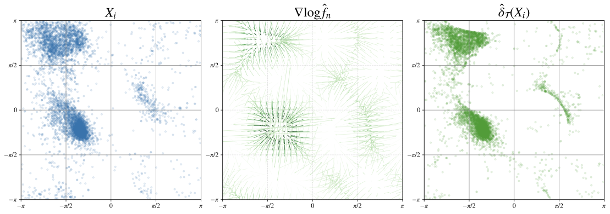
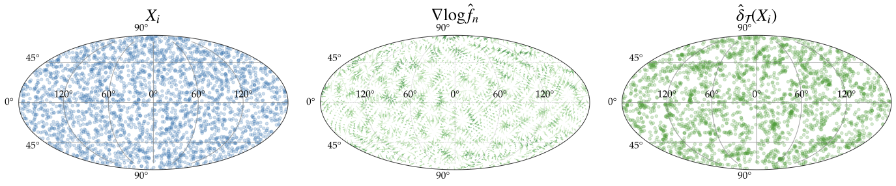

# Nonparametric Riemannian Empirical Bayes

**Adam Q. Jaffe, Leonardo V. Santoro, Bodhisattva Sen**

Empirical Bayes approach to denoising measurements of latent variables on manifolds via a score-based field achieving near-Bayes optimality. Companion code to the paper.

---

## Overview

A fully data-driven denoiser for measurements of latent variables on compact Riemannian manifolds. Given noisy observations $X_i = \exp_{\Theta_i}(\sigma \varepsilon_i)$ of unknown latent points $\Theta_i$ on a manifold $\mathcal{M}$, the method recovers a denoised estimate $\hat\delta(X_i) \approx \Theta_i$ without assuming any parametric form for the prior distribution.

The denoiser is a Tweedie-type field $\hat\delta_{\mathcal{T}}$ built from a nonparametric estimate $\hat f_n$ of the marginal density of the observations: the latent point is recovered by moving each observation along the estimated score $\nabla \log \hat f_n$. The density is estimated by a truncated eigenfunction (spectral) expansion of order $M$, and its score is regularised at percentile level $\rho$. Both hyperparameters are selected from the data alone — no knowledge of the prior or the truth is required.

**Supported manifolds:** $S^1$ (circle), $S^2$ (sphere), $SO(3)$ (rotations), $T^2$ (torus).


## Installation

Requires Python 3.9+. Install the dependencies:

```bash
pip install numpy scipy pandas scikit-learn matplotlib seaborn geomstats tqdm joblib biopython
```

(`biopython` is only needed for the protein/torus example.)

## Quick start

Run from the `src/` directory (the package is imported as `utils`):

```python
import numpy as np
from utils import (
    get_manifold,
    multimodal_sampler,
    scoreMatchingKFoldCV,
    denoiser,
    sq_loss,
)

manifold_type = 'S1'          # circle — also 'S2', 'SO3', 'T2'
manifold      = get_manifold(manifold_type)
sigma2        = 0.15
n             = 2000

# 1. Generate data: sample prior, add Riemannian Gaussian noise
Theta = multimodal_sampler(manifold_type, n, tau2=0.05, num_modes=3)
X     = manifold.random_riemannian_normal(Theta, 1. / sigma2, n)

# 2. Select hyperparameters by score-matching cross-validation
params = scoreMatchingKFoldCV(manifold_type, X,
                              M_grid=np.arange(2, 12),
                              rho_percentile=np.arange(2, 20))
M, rho = params['AIC']

# 3. Denoise
delta = denoiser(manifold_type, X, M, rho, sigma2, X)

print(f"MSE (noisy):    {sq_loss(manifold, X,     Theta):.4f}")
print(f"MSE (denoised): {sq_loss(manifold, delta, Theta):.4f}")
```
---


## Selecting hyperparameters by score matching

The truncation level $M$ and the regularisation percentile $\rho$ are chosen by $K$-fold cross-validation using the Hyvärinen **score-matching** loss, which can be evaluated without ever observing the latent $\Theta_i$. `scoreMatchingKFoldCV` returns the optima under three model-selection criteria — `'cv'` (raw CV score), `'AIC'`, and `'BIC'` — each a resolved `(M, rho)` pair:

```python
params = scoreMatchingKFoldCV(manifold_type, X,
                              M_grid=np.arange(2, 12),
                              rho_percentile=np.arange(2, 20))
M, rho = params['AIC']      # also params['cv'], params['BIC']
```

For larger problems (e.g. $S^2$, $T^2$) you can instead search over the number of retained eigenfunctions $k$ by passing `k_modes_grid=...` with `M_grid=None`; the chosen $k$ maps back to an effective $M$ via `k_to_M`.


---

## Replicating the figures

All scripts live under `src/` and assume the working directory is the script's own folder. Figures are written to `src/fig/`. The real-data and intro scripts cache their expensive computations under `src/fig/cache/`; set `force_recompute = True` at the top of a script to recompute from scratch.

```bash
cd src
./make_figures.sh    
```


### Real-data examples

```bash
cd src/real_data
python astro.py     # → fig/astro.pdf, fig/astro_cv_k.pdf   (BATSE gamma-ray bursts, S^2)
python chemi.py     # → fig/chemi_M2.pdf, fig/chemi_summary_M2.pdf, fig/chemi_cv_k.pdf  (protein torsion angles, T^2)
```

### Simulation rate plots

Pre-computed Monte-Carlo results are already checked in under `src/simulations/data/`, so you can render the rate figures directly.
To regenerate the underlying results from scratch (slow — runs the full Monte-Carlo study defined in `simulations/params/params.py`):

```bash
cd src/simulations
python script_rate.py       # writes a fresh data/<manifold>/<timestamp>/ run (was computed on a cluster in parallel for considerable speedup)
```

`plot_rates.py` automatically picks up the most recent timestamped run.

---

## Repository layout

```
src/
├── utils/                 core library (imported as `utils`)
│   ├── denoiser.py            Tweedie-type denoiser
│   ├── density_estimation.py  spectral density / score estimation
│   ├── crossvalidation.py     score-matching K-fold CV
│   ├── priors.py              prior samplers (multimodal, uniform, cap, equator, ...)
│   ├── oracle.py              oracle / Bayes denoiser for benchmarking
│   ├── helpers.py             manifolds, losses, data generation
│   └── plotting/              S1 / S2 / T2 plotting helpers
├── simulations/           Monte-Carlo rate study (script_rate.py, plot_rates.py)
├── real_data/             astronomy (astro.py) and protein (chemi.py) examples
└── fig/                    generated figures
```

---

### Example: Estimating Torsion Angles of Adjacent Amino Acids in a Protein


### Example: Denoising Gamma Ray Bursts (Astronomy Application)

